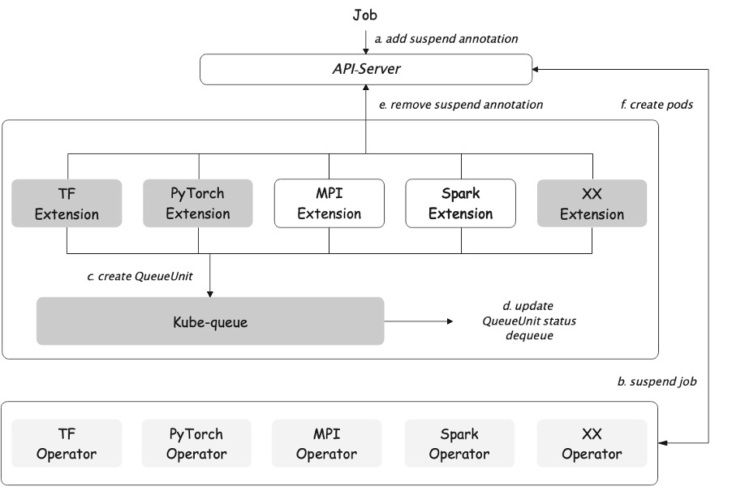

[](https://opensource.org/licenses/Apache-2.0)
[](https://app.travis-ci.com/kube-queue/kube-queue)

# Kube-queue
kube-queue is designed to manage AI/ML and batch workloads in Kubernetes. It allows system admins to customize job queue management for queues to provide flexibility and fairness between different queues. Combined with a quota system (similar to Kubernetes resource quota), kube-queue automates and optimizes workload and resource quota mangement to maximize cluster resource utilization.

### Architecture


### Key features
- Job queue based on workload priority and creation time and quota
- Support dynamic adjustment of job priority in queue
- Provide faireness between queues


### Install
1. Clone this repo to your machine
```shell
$ git clone https://github.com/kube-queue/kube-queue.git
```

2. Change to kube-queue directory:
```shell
$ cd kube-queue
```

3. Deploy kube-queue with Helm
```shell
$ helm install kube-queue -n kube-system ./charts/v0.0.1
NAME: kube-queue
LAST DEPLOYED: Mon Sep 13 10:15:34 2021
NAMESPACE: kube-system
STATUS: deployed
REVISION: 1
TEST SUITE: None
```

4. Check running status of kube-queue
```shell
$ helm get manifest kube-queue  -n kube-system | kubectl get -n kube-queue -f -
NAME                   STATUS   AGE
namespace/kube-queue   Active   2m17s

NAME                        SECRETS   AGE
serviceaccount/kube-queue   1         2m16s

NAME                                                                           CREATED AT
customresourcedefinition.apiextensions.k8s.io/queueunits.scheduling.x-k8s.io   2021-09-13T02:15:36Z

NAME                                               CREATED AT
clusterrole.rbac.authorization.k8s.io/kube-queue   2021-09-13T02:15:36Z

NAME                                                                         ROLE                     AGE
clusterrolebinding.rbac.authorization.k8s.io/kube-queue-clusterrolebinding   ClusterRole/kube-queue   2m16s

NAME                                        READY   UP-TO-DATE   AVAILABLE   AGE
deployment.apps/kube-queue-controller       1/1     1            1           2m16s
deployment.apps/tf-operator-extension       1/1     1            1           2m17s
deployment.apps/pytorch-operator-extesion   1/1     1            1           2m17s
```

5. Uninstall kube-queue with Helm
```shell
$ helm uninstall kube-queue -n kube-system
```

### Example

We will submit two tensorflow (tf) jobs to the cluster at the same time, but the current cluster can only meet the resource requests of one job so one job is running and the other job is queued by kube-queue, and the pods of the queued job are not created.

#### 1. Deploy tf-operator that can support queue ( Ensure that no other tf-operator is deployed in the cluster)
```shell
$ kubectl apply -f examples/tf-operator/
customresourcedefinition.apiextensions.k8s.io/tfjobs.kubeflow.org created
serviceaccount/tf-job-operator created
clusterrole.rbac.authorization.k8s.io/tf-job-dashboard created
clusterrole.rbac.authorization.k8s.io/tf-job-operator created
clusterrolebinding.rbac.authorization.k8s.io/tf-job-operator created
deployment.apps/tf-job-operator created
```

#### 2. Check running status of tf-operator
```shell
$ kubectl get -f examples/tf-operator/
NAME                                                                CREATED AT
customresourcedefinition.apiextensions.k8s.io/tfjobs.kubeflow.org   2021-09-13T06:46:39Z

NAME                             SECRETS   AGE
serviceaccount/tf-job-operator   1         9s

NAME                                                     CREATED AT
clusterrole.rbac.authorization.k8s.io/tf-job-dashboard   2021-09-13T06:46:39Z
clusterrole.rbac.authorization.k8s.io/tf-job-operator    2021-09-13T06:46:39Z

NAME                                                           ROLE                          AGE
clusterrolebinding.rbac.authorization.k8s.io/tf-job-operator   ClusterRole/tf-job-operator   9s

NAME                              READY   UP-TO-DATE   AVAILABLE   AGE
deployment.apps/tf-job-operator   1/1     1            1           8s
```

#### 3. Create ResourceQuota for default namespace
```shell
$ kubectl create -f examples/tfjob/resource_quota.yaml
resourcequota/default created

$ kubectl get resourcequota default -o wide
NAME      AGE   REQUEST                   LIMIT
default   76s   cpu: 0/4, memory: 0/4Gi
```

#### 4. Submit tf jobs
```shell
$ kubectl create -f examples/tfjob/job1.yaml;kubectl create -f examples/tfjob/job2.yaml
tfjob.kubeflow.org/job1 created
tfjob.kubeflow.org/job2 created
```

#### 5. Check the status of tf jobs
5.1 At the beginning, only one job creates the pod and runs successfully.
```shell
$ kubectl get tfjob
NAME   STATE     AGE
job1   Running   5s
job2   Queuing   5s

$ kubectl get pods
NAME            READY   STATUS    RESTARTS   AGE
job1-ps-0       1/1     Running   0          8s
job1-worker-0   1/1     Running   0          8s
job1-worker-1   1/1     Running   0          8s
```
5.2 When the state of job1 is `Succeeded`. Job2 will continue to run.
```shell
$ kubectl get tfjob
NAME   STATE       AGE
job1   Succeeded   38s
job2   Running     38s

$ kubectl get pods
NAME            READY   STATUS      RESTARTS   AGE
job1-worker-0   0/1     Completed   0          54s
job1-worker-1   0/1     Completed   0          54s
job2-ps-0       1/1     Running     0          22s
job2-worker-0   1/1     Running     0          22s
job2-worker-1   1/1     Running     0          21s
```

5.3 Finally, the state of the two jobs are `Succeeded`.
```shell
$ kubectl get tfjob
NAME   STATE       AGE
job1   Succeeded   71s
job2   Succeeded   71s

$ kubectl get pods
NAME            READY   STATUS      RESTARTS   AGE
job1-worker-0   0/1     Completed   0          5m
job1-worker-1   0/1     Completed   0          5m
job2-ps-0       0/1     Completed   0          4m28s
job2-worker-0   0/1     Completed   0          4m28s
```
