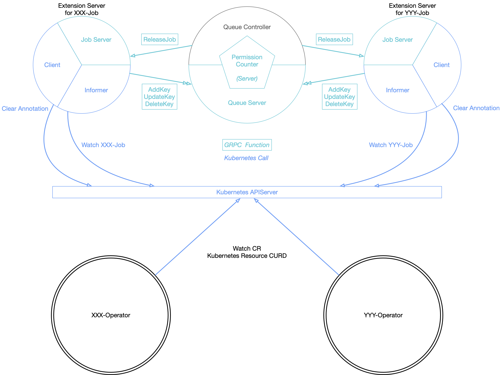

# Design

## Architecture

Kube-Queue is designed with compliance of micro-service, making extensibility as the priority.

We divide the overall system into 3 parts:

1. Queue Controller
2. Permission Counter
3. Extension Servers

The **Queue Controller** manages one or multiple queue(s) with `QueueUnit` corresponding to all jobs monitored. The major functionality of the Queue Controller is to decide which job should be processed.

When the Queue Controller processes a job, the `syncHandler` function calls the `RequestPermission` API from a **Permission Counter** instance and receive a True/False return. (*We shall provide a default Permission Counter implementation, which simply grants permission when resource remained (toto_quota - reserved) is enough for the job described in the request message.*)

*The Permission Counter resides within the Queue Controller in case of communication overhead.*

To watch events of various jobs, such like TF-Job, MPI-Job, we setup an **Extension Server** for each kind of job. The informer within the Extension Server sends `AddKey`, `UpdateKey` and `DeleteKey` requests to Queue Controller, adding `QueueUnit` to queues. When the Queue Controller decides to release a job, it sends the `Release` request to the Extension Server, which will update the corresponding CR via its own client.

*The GRPC communication is not restricted to TCP protocol. When all parts are capsuled into one Pod, we can take the advantage of Unix protocol to avoid network latency.*
