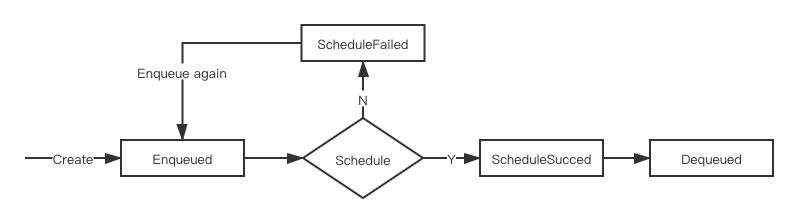
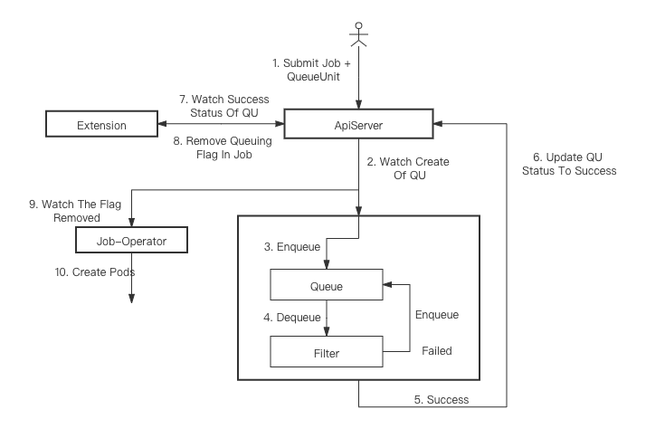

# Queue Unit 

## Motivations

Different types of jobs belongs to different compute frameworks have different definitions and schemas like [TFJob](https://github.com/kubeflow/tf-operator/blob/master/pkg/apis/tensorflow/v1/types.go)、[PyTorcJob](https://github.com/kubeflow/pytorch-operator/blob/master/pkg/apis/pytorch/v1/types.go) or [MPIJob](https://github.com/kubeflow/mpi-operator/blob/master/pkg/apis/kubeflow/v1/types.go). They define the resource request and job priority in different ways. Parsing information from different types of jobs is different. Therefore, we need a general API to define the information related to scheduling and queuing.


### Goals

- A general API to define the information related to scheduling and queuing

## Proposal

A "CRD" is needed to interact with the kube-queue. The CRD kind name is subject to change. We use "QueueUnit" in the proposal. The CRD defines the information related to scheduling and queuing. "QueueUnit" is namespace scoped.

```yaml
apiVersion: queue.k8s.io/v1alpha1
kind: QueueUnit
metadata:
  name: unit1
  namespace: default
spec:
  consumerRef: # the origin job
    apiVersion: kubeflow.org/v1
    kind: TFJob
    name: job1
    namespace: default
  queue: default # The name of the submission queue
  priority: 100
  priorityClassName: high-priority
  resource: # The resource request of the job
    cpu: 40
```

The API and Status are described below:

```go
type QueueUnit struct {
	metav1.TypeMeta   `json:",inline"`
	metav1.ObjectMeta `json:"metadata" protobuf:"bytes,1,name=metadata"`
	Spec              QueueUnitSpec   `json:"spec" protobuf:"bytes,2,name=spec"`
	Status            QueueUnitStatus `json:"status,omitempty" protobuf:"bytes,3,opt,name=status"`
}

type QueueUnitSpec struct {
	ConsumerRef       *corev1.ObjectReference `json:"consumerRef,omitempty" protobuf:"bytes,1,opt,name=consumerRef"`
	Priority          *int32                  `json:"priority,omitempty" protobuf:"varint,2,opt,name=priority"`
	Queue             string                  `json:"queue,omitempty" protobuf:"bytes,3,opt,name=queue"`
	Resource          corev1.ResourceList     `json:"resource,omitempty" protobuf:"bytes,4,name=resource"`
	PriorityClassName string                  `json:"priorityClassName,omitempty" protobuf:"bytes,5,opt,name=priorityClassName"`
}

type QueueUnitStatus struct {
	Phase   QueueUnitPhase `json:"phase" protobuf:"bytes,1,name=phase"`
	Message string         `json:"message,omitempty" protobuf:"bytes,2,opt,name=message"`
}

type QueueUnitPhase string

const (
	Enqueued       QueueUnitPhase = "Enqueued"
	Dequeued       QueueUnitPhase = "Dequeued" 
	ScheduleSucced QueueUnitPhase = "ScheduleSucced"
	ScheduleFailed QueueUnitPhase = "ScheduleFailed"
)
```
The state machine is shown in the figure below.  `ScheduleSucced` and `ScheduleFailed` are only internal state. 

1. After the `QueueUnit` is created, it is added to the queue and the status is updated to `Enqueued`.
2. After a period of queuing, the `QueueUnit` enters the scheduling process. 
3. If the scheduling is successful, the internal state is updated to `ScheduleSucced`. When the internal state is updated to `ScheduleSucced`, the status is updated to `Dequeued`
4. If scheduling fails, the internal state is updated to `ScheduleFailed` and the message describes the reason. The information will be sent through the event and the status remains `Enqueued`.




### Lifecycle of CRD

#### Create CRD

The interaction process after creating the queueunit is shown in the figure below.



#### Update CRD

When the status of `QueueUnit` is `Enqueued`, only `Priority` of `QueueUnit` can be mutated. But there may be a delay in state synchronization. If the scheduling is successful, the status has not been updated, the update of CRD will be invalid.

When the status of `QueueUnit` is `Dequeued`, `QueueUnit` can't be mutated.


### Delete CRD

Users need to delete the object of `QueueUnit` along with the job.


## Use Case

## Implementation History